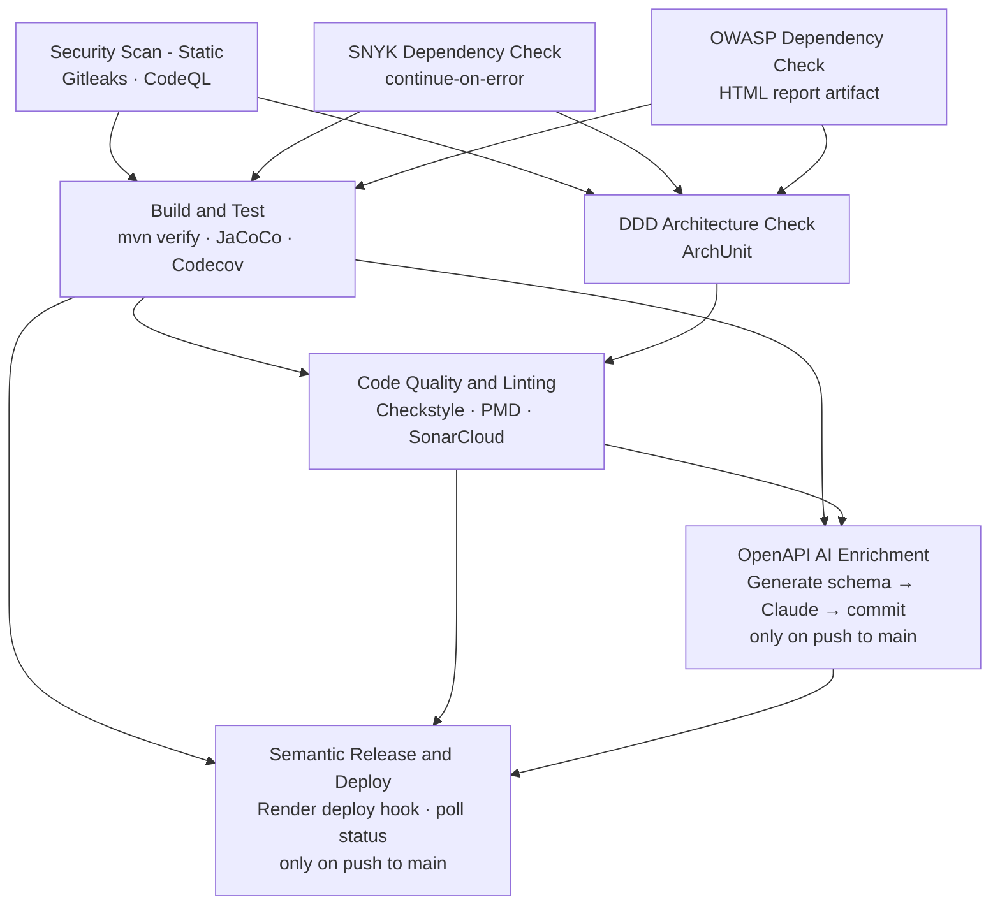

# SmartCity Backend

[](https://github.com/zaricu22/SmartCity-Backend/actions/workflows/ci-cd.yml)
[](https://codecov.io/gh/zaricu22/SmartCity-Backend)
[](https://sonarcloud.io/project/overview?id=zaricu22_SmartCity-Backend)
[](https://openjdk.org/projects/jdk/17/)

A Spring Boot 3.5 REST API for managing smart city infrastructure — public buildings and their energy devices. Built as an architectural reference for **Domain-Driven Design (DDD) with Onion Architecture**, with a full CI/CD pipeline including security scanning, mutation testing, and AI-enriched OpenAPI documentation.

---

## Live Demo

Swagger UI: [https://smartcity-backend-9g09.onrender.com/SmartCityREST/swagger-ui.html](https://smartcity-backend-9g09.onrender.com/SmartCityREST/swagger-ui.html)

Health check: [https://smartcity-backend-9g09.onrender.com/SmartCityREST/actuator/health](https://smartcity-backend-9g09.onrender.com/SmartCityREST/actuator/health)

Frontend: [https://zaricu22.github.io/SmartCity-Frontend](https://zaricu22.github.io/SmartCity-Frontend)

---

## Features

| Feature | Description |
|---|---|
| Buildings | Create and query public buildings by ID or list all |
| Energy devices | Attach solar, pump, or battery devices with rated capacity |
| Consumption | Update a building's current energy consumption (validated against total device capacity) |
| Production | Update a device's current production rate (validated against rated capacity) |
| Real-time | WebSocket push notifications on consumption and device changes |
| Subsidy eligibility | Domain specification evaluating buildings for government energy subsidy — queryable via `GET /v1/buildings?eligible=true` (query projection, no full entity load) |
| AI-enriched docs | OpenAPI spec enriched with Claude — descriptions, examples, metadata |

---

## Tech Stack

| | Technology |
|---|---|
| Language | Java 17 |
| Framework | Spring Boot 3.5 |
| Persistence | Spring Data JPA + PostgreSQL (Testcontainers in tests) |
| API docs | Springdoc OpenAPI 2 (Swagger UI) |
| Real-time | WebSocket (STOMP) |
| Build | Maven 3.9 |
| Containerization | Docker |
| CI/CD | GitHub Actions → Render |
| Unit / integration tests | JUnit 5, Testcontainers, WireMock, REST Assured, Spring Cloud Contract |
| Architecture tests | ArchUnit (DDD layer rules enforced on every push) |
| Mutation testing | PIT (scheduled weekly, 65% mutation score threshold) |
| Security | Gitleaks, CodeQL, Snyk, OWASP Dependency-Check |
| Code quality | SonarCloud, Codecov, Checkstyle, PMD, JaCoCo |

---

## Architecture

This project follows **Domain-Driven Design (DDD)** with an **Onion Architecture**, organizing code into concentric layers where outer layers depend on inner ones, never the reverse. ArchUnit rules enforce these boundaries on every push.

```
┌──────────────────────────────────────────────────────┐
│              Infrastructure / Web API                │  Controllers, WebSocket, JPA, External Clients
│   ┌──────────────────────────────────────────────┐   │
│   │             Application Layer                │   │  Services, Commands, Event Handlers
│   │   ┌──────────────────────────────────────┐   │   │
│   │   │           Domain Layer               │   │   │  Aggregates, Entities, Events, Specs
│   │   └──────────────────────────────────────┘   │   │
│   └──────────────────────────────────────────────┘   │
└──────────────────────────────────────────────────────┘
```

| Layer | Package | Responsibility |
|---|---|---|
| Domain | `asset.domain` | Aggregates, entities, value objects, domain events, specifications — no framework dependencies |
| Application | `asset.application` | Use cases, commands, event handlers, DTOs — orchestrates domain, owns `@Transactional` boundaries |
| Infrastructure | `asset.infrastructure` | JPA entities and repositories, external HTTP clients |
| Web API | `asset.webapi` | REST controllers, WebSocket handler, request/response models, exception mapping |

---

## Getting Started

### Prerequisites

- **Java 17+** — `java --version`
- **Docker** — required for Testcontainers
- **Maven 3.9+** — or use the included `./mvnw` wrapper

### Clone

```bash
git clone https://github.com/zaricu22/SmartCity-Backend.git
cd SmartCity-Backend
```

### Environment Variables

**Variables:**
Create a `.env` file in the project root with your database credentials. See `.env.example` for the required variables.

| Variable | Description | Example |
|---|---|---|
| `DB_URL` | PostgreSQL JDBC connection URL | `jdbc:postgresql://localhost:5432/smartcity` |
| `DB_USERNAME` | Database username | `admin` |
| `DB_PASSWORD` | Database password | `secret` |

**Profiles:**
| Profile | Purpose |
|---|---|
| `dev` | Local development, port 8080, verbose logging |
| `ci` | H2 in-memory database, used for OpenAPI schema generation in CI |
| `test` | Testcontainers-managed PostgreSQL, used by the test suite |
| `prod` | Production — database credentials injected via environment variables |

### Run locally (dev profile)

```bash
./mvnw spring-boot:run -Dspring-boot.run.profiles=dev
```

The application starts on `http://localhost:8080/SmartCityREST`.

---

## API Documentation

Once the application is running, Swagger UI is available at:

```
http://localhost:8080/SmartCityREST/swagger-ui.html
```

> **AI-enriched spec:** Swagger UI loads an enhanced OpenAPI spec from `/openapi/enhanced-openapi.json` instead of the raw auto-generated one. This file is produced by a Claude-powered script that enriches the base spec with descriptions, examples, and additional metadata. See `application.properties` → `springdoc.swagger-ui.url`.

### Asset Endpoints — `/v1/buildings`

| Method | Path | Role | Status | Notes |
|--------|------|------|--------|-------|
| `POST` | `/v1/buildings` | ADMIN | 201 | `Location` header + UUID body |
| `GET` | `/v1/buildings` | VIEWER, ADMIN | 200 | Paginated · `?page=0&size=20&sort=name` |
| `GET` | `/v1/buildings?eligible=true` | VIEWER, ADMIN | 200 | Subsidy-eligible buildings only — query projection (`devices` always empty) |
| `GET` | `/v1/buildings/{id}` | VIEWER, ADMIN | 200 | `PublicBuildingResponse` |
| `POST` | `/v1/buildings/{id}/devices` | ADMIN | 204 | |
| `PATCH` | `/v1/buildings/{id}/consumption` | ADMIN | 204 | |
| `PATCH` | `/v1/buildings/{buildingId}/devices/{deviceId}/production` | ADMIN | 204 | |

### Auth Endpoints — `/v1/auth`

| Method | Path | Auth required | Status | Body |
|--------|------|---------------|--------|------|
| `POST` | `/v1/auth/register` | None | 201 | `{ token, role, expiresInMs, refreshToken }` |
| `POST` | `/v1/auth/login` | None | 200 | `{ token, role, expiresInMs, refreshToken }` |
| `POST` | `/v1/auth/refresh` | None | 200 | `{ token, role, expiresInMs, refreshToken }` |
| `POST` | `/v1/auth/logout` | Bearer JWT | 204 | |

### OAuth2

| Path | Notes |
|------|-------|
| `GET /oauth2/authorization/google` | Redirect to Google consent page |
| `GET /login/oauth2/code/google` | Google callback → JWT issued → redirect to frontend with tokens in URL fragment |

### WebSocket

```
ws://localhost:8080/SmartCityREST/ws
```

Connect via STOMP/SockJS, then subscribe to receive real-time push notifications.

**Auth:** the handshake itself is unauthenticated (`permitAll` — browsers can't attach
a custom `Authorization` header to a WebSocket/SockJS handshake). Instead, send the JWT
as a STOMP `CONNECT` header: `Authorization: Bearer <token>` on the `CONNECT` frame
(e.g. `@stomp/stompjs`'s `connectHeaders` option). Missing, invalid, or revoked tokens
are rejected at CONNECT.

| Topic | Triggered by |
|-------|-------------|
| `/topic/buildings` | `BuildingCreatedEvent` (collection-level — no per-id subscriber can exist before creation) |
| `/topic/buildings/{id}/consumption` | `ConsumptionChangedEvent` |
| `/topic/buildings/{id}/devices` | `DeviceAddedEvent` |
| `/topic/buildings/{id}/production` | `ProductionChangedEvent` |

---

## CI/CD Pipeline

Every push and pull request to `dev` or `main` runs the full pipeline on GitHub Actions.



| Job | Trigger | Tool |
|---|---|---|
| Secret scan + SAST | all branches | Gitleaks + CodeQL |
| Dependency check | all branches | Snyk + OWASP Dependency-Check |
| Build + test + coverage | all branches | JUnit 5 + JaCoCo + Codecov |
| DDD architecture check | all branches | ArchUnit |
| Lint + static analysis | all branches | Checkstyle + PMD + SonarCloud |
| OpenAPI enrichment | `main` push, API files changed | Claude + swagger-cli |
| Release + deploy | `main` push only | Semantic Release + Render |
| Mutation testing | weekly (Mon 2 AM) + manual dispatch | PIT — separate `mutation-testing.yml` workflow |

> **Deployment:** Render builds and runs the application directly from the `Dockerfile` — no manual build step required.

Secrets required: `CODECOV_TOKEN`, `SNYK_TOKEN`, `SONAR_TOKEN`, `GH_TOKEN`, `ANTHROPIC_API_KEY`, `RENDER_DEPLOY_HOOK_URL`, `DB_URL`, `DB_USERNAME`, `DB_PASSWORD`.

---

## Running Tests

**All tests (unit + integration):**
```bash
./mvnw verify
```
Requires Docker — Testcontainers spins up a PostgreSQL container automatically.

**Architecture rules only (no Docker needed):**
```bash
./mvnw test-compile surefire:test -Dtest=DddArchitectureTest
```

**With coverage report:**
```bash
./mvnw verify
# Report written to target/site/jacoco/index.html
```

**Mutation testing (scheduled weekly in CI, run locally on demand):**
```bash
./mvnw test-compile org.pitest:pitest-maven:mutationCoverage -Pmutation-testing
# Report written to target/pit-reports/index.html
```

Coverage thresholds enforced on every push: 70% line coverage (JaCoCo), 80% patch coverage (Codecov), SonarCloud quality gate.

---

## Project Structure

```
src/
├── main/java/com/example/smartcityback/
│   └── asset/                          # Bounded context: buildings & energy devices
│       ├── domain/                     # Pure domain — no framework dependencies
│       │   ├── aggregate/              #   PublicBuilding (aggregate root)
│       │   ├── entity/                 #   EnergyDevice
│       │   ├── valueobject/            #   Energy (immutable, kW/MW/GW conversion)
│       │   ├── event/                  #   DeviceAddedEvent, ConsumptionChangedEvent
│       │   ├── specification/          #   SubsidyEligibilitySpecification
│       │   ├── readmodel/              #   PublicBuildingSummary (query projection shape)
│       │   ├── exception/              #   DomainException, ValidationException, ...
│       │   ├── repository/             #   PublicBuildingRepository (port/interface)
│       │   └── shared/enums/           #   DeviceType, EnergyUnit, ErrorCode
│       ├── application/                # Use cases, orchestration
│       │   ├── service/                #   PublicBuildingAppService (writes, @Transactional)
│       │   │                           #   PublicBuildingQueryService (reads, readOnly)
│       │   ├── command/                #   CreateBuildingCommand, AddDeviceCommand, ...
│       │   ├── dto/                    #   PublicBuildingDto, EnergyDeviceDto
│       │   ├── mapper/                 #   BuildingDtoMapper (domain → DTO)
│       │   ├── eventhandler/           #   AuditLogEventHandler
│       │   └── exception/              #   BuildingNotFoundException
│       ├── infrastructure/             # Framework adapters
│       │   └── persistence/
│       │       ├── entity/             #   PublicBuildingJpaEntity, EnergyDeviceJpaEntity
│       │       ├── repository/         #   PublicBuildingRepositoryImpl (implements port)
│       │       ├── specification/      #   SubsidyEligibilityJpaSpecification (Criteria API)
│       │       └── mapper/             #   BuildingPersistenceMapper (domain ↔ JPA entity)
│       └── webapi/                     # HTTP + WebSocket entry points
│           ├── controller/             #   PublicBuildingController
│           ├── handler/                #   BuildingWebSocketEventHandler
│           ├── request/                #   CreateBuildingRequest, AddDeviceRequest, ...
│           ├── response/               #   (mapped from DTOs)
│           └── exception/              #   GlobalExceptionHandler, ErrorResponse
└── test/java/com/example/smartcityback/
    └── asset/
        ├── domain/                     # Pure unit tests — no Spring context
        ├── application/                # Service unit tests with Mockito
        ├── infrastructure/             # Repository tests with Testcontainers
        ├── webapi/
        │   ├── controller/             #   @WebMvcTest — exception → HTTP mapping
        │   ├── integration/            #   Full integration tests (real DB + REST Assured)
        │   └── external/               #   WireMock contract tests
        └── DddArchitectureTest.java    # ArchUnit — 17 DDD structural rules
```
