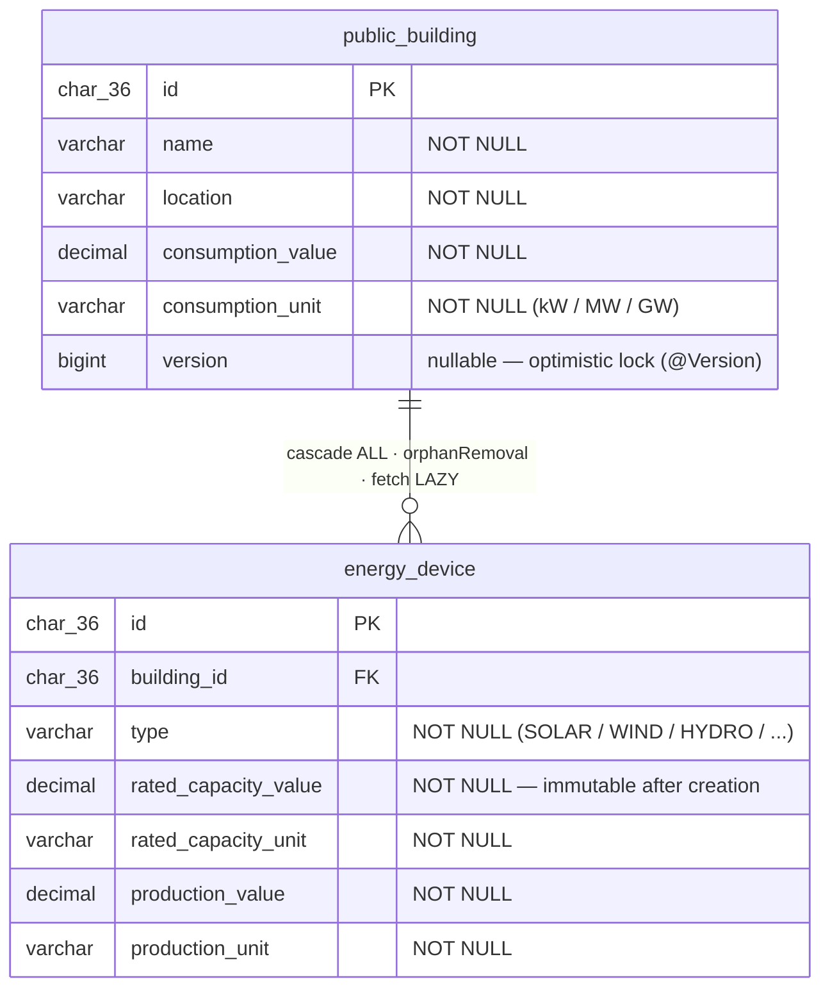

# Entity-Relationship Diagram

Database schema for the `asset` bounded context. The `auth` context uses no persistent tables — user registry, refresh tokens, and token blacklist are in-memory.

## Notes

- IDs are `CHAR(36)` UUID strings — CockroachDB and MySQL have no native UUID type.
- `consumption_value` / `consumption_unit` and the two `Energy` pairs on `energy_device` are mapped via `@Embedded @AttributeOverrides` — each `Energy` value object becomes two flat columns.
- `version` is a nullable `Long` wrapper (not primitive `long`) so that new entities with `null` version can be persisted without Hibernate treating `0` as a first-update conflict.
- `orphanRemoval = true` on the `OneToMany` means deleting a device from `PublicBuilding.devices` in Java automatically issues a `DELETE` — no explicit repository call needed.
- The domain's `PublicBuildingRepository` interface and `PublicBuildingRepositoryImpl` are the only paths through which these tables are accessed; controllers and application services never touch JPA entities directly.
